2024 look back, 2025 look forward (?)

	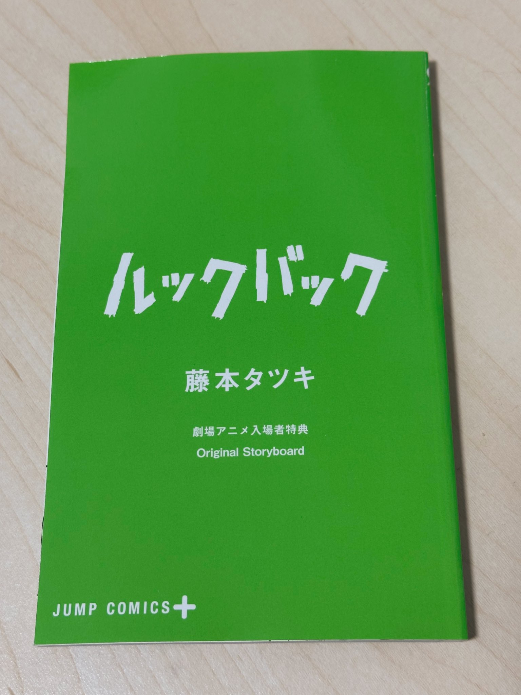
	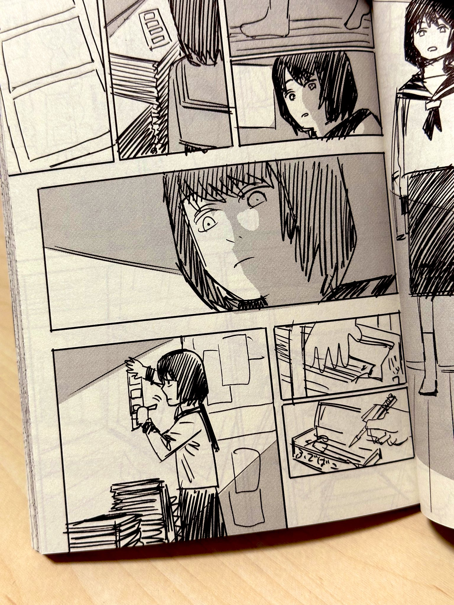

a storyboard booklet I received in July after watching Look Back

First and foremost, I would like to ask you, dear reader, to watch Look Back. I saw it twice in theaters and teared up both times. I had read the manga and enjoyed it a lot, but the animated movie version somehow gave me even more emotional damage. Maybe it was the timing of when I saw it, or the amazing moving soundtrack by haruka nakamura, or the gorgeous expressive animation... or everything...

Today I'll try to look back on how the last year went.

    
Movies I watched/rewatched in 2024 (my favorites marked with 💟)

	<li>Godzilla 1.0 (2023)</li>
	<li>💟 Perfect Days (2023)</li>
	<li>The Stranger by the Beach　/　海辺のエトランゼ (2020)</li>
	<li>💟 I Saw the TV Glow (2024)</li>
	<li>Godzilla (1954)</li>
	<li>Furiosa: A Mad Max Saga (2024)</li>
	<li>Iké Boys　/　イケボーイズ (2021)</li>
	<li>💟 Look Back　/　ルックバック (2024)</li>
	<li>A Quiet Place: Day One (2024)</li>
	<li>The Forever Purge (2021)</li>
	<li>Ferrari (2023)</li>
	<li>Passengers (2016)</li>
	<li>💟 BlackBerry (2023)</li>
	<li>Eraser (1996)</li>
	<li>Passengers (2016)</li>
	<li>💟 GoodFellas (1990)</li>
	<li>Pulp Fiction (1994)</li>
	<li>💟 Fly me to the Saitama　/　飛んで埼玉 (2019)</li>
	<li>Fly me to the Saitama ~From Biwa Lake With Love~　/　翔んで埼玉 〜琵琶湖より愛をこめて〜 (2023)</li>
	<li>Twisters (2024) (in 4DX!!)</li>
	<li>💟 Mononoke The Movie: Phantom In The Rain　/　劇場版　モノノ怪　唐傘 (2024)</li>
	<li>The Colors Within　/　きみの色 (2024)</li>
	<li>The Godfather (1972)</li>
	<li>💟 American Psycho (2000)</li>
	<li>Saw (2004)</li>
	<li>💟 Tokyo Sonata (2008)</li>
	<li>💟 Gonjiam: Haunted Asylum (2018)</li>
	<li>The Medium (2021)</li>
	<li>It's What's Inside (2024)</li>
	<li>Monty Python and the Holy Grail (1975)</li>
	<li>The Truman Show (1998)</li>
	<li>The Last Shot In The Bar　/　探偵はBARにいる (2017)</li>
	<li>💟 Tokyo Godfathers　/　東京ゴッドファーザーズ (2003)</li>
	<li>Saint Young Men The Movie ~Holy Men vs Demon Army~　/　聖☆おにいさん THE MOVIE～ホーリーメン VS 悪魔軍団～ (2024)</li>
	<li>Interstellar (2014)</li>
	<li>Uncut Gems (2019)</li>
	 
	man I love movies. It's also really nice to rewatch Japanese movies again now that I know a bit of Japanese. I really treasure those moments of recognizing a deeper cultural context behind a scene or a more nuanced meaning behind a line, and being like, "oh!!!!!!"
	 
	I want to watch like 3x more movies next year......

In 2024, I set some themes for myself: the three H's of Happiness, Hobbies, and Health. I think I fulfilled those themes pretty sufficiently!

At the same time, when I look back at last year I have to recognize that it was a rough year for me. My biggest struggle was my comical lack of self-confidence. I tried not let it get to me, but sadly I feel like it ended up being my greatest vice. It's tough to not be able to meet my own expectations countless times - but I need to forgive myself for that. Failing is okay, actually...! At the end of the day, I'm so lucky to be surrounded by kind and supportive people that help me when I'm lost in my own anxieties.

In November I was lucky to be able to travel a bit in Taipei, Taiwan with my good friend Amy. We talked about how much time we spend on our phones to the detriment of our productivity. They joked that if only we spent less time on our phones doomscrolling and watching content sludge, we would have more time to invent things. I laughed - but for some reason, it stuck with me. It's true! I want to spend more time inventing things...

Another conversation that stuck with me - chatting with my friend Dave about how guys will evolve into becoming shed guys. Like, in my mind I'm imagining a gruff old man that has a log cabin by the lake displaced from civilization, occasionally going to a shed out back to work on his passion projects in solitude... 

I have decided that it is inevitable that my life trajectory will lead me to being a shed guy. 
Therefore, my 2025 theme is "in my shed era". Meaning that I want to focus on reviving my creative spirit and following through on finishing projects and learning new skills!

<falselink>2025's theme: in my shed era</falselink>

Some random casual goals:
- keep studying Japanese and Korean (and Esperanto for fun)
- start studying Chinese (very slowly...)
- get comfortable with Blender/After Effects (already playing around with them!)
- make and publish a VRChat world
- finish タトゥーメイド喫茶 one-shot manga
- compile a zine about my experience living abroad in japan
- post more online...? at least once a month to my blog or to instagram
- keep a weekly average of 10k steps 🔥
- get a cat (🙏)

そしてせっかく日本語を勉強しているし、東京に住んでいて日本語者と話したいし、日本語で書いたりとかをやってみたいですね。自信が足りるまで頑張ります。

When I read this list it seems like a lot, but I'd still be happy even if just a few items were checked off at the end of the year! I'll do my best...!

I mentioned that this year was rough for me, and part of that was coming to terms with losing dear friends and respected peers along the way. While I may never understand why things happened the way they did, I think I should choose to live in the light of their memories. In this world where tensions, war, and misunderstandings seem to be increasing, making things is all I know how to do. If I don't do that then I'd be totally lost. So I'd better do a lot of that before I lose my mind!!

Speaking of learning new skills... here are my first ever film camera photos!!!

	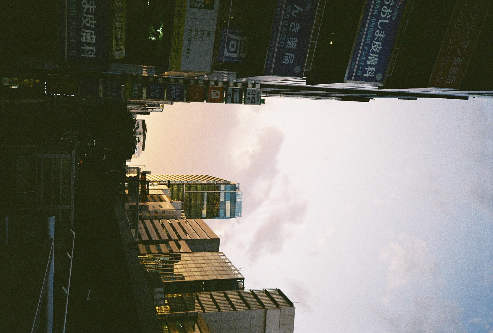
	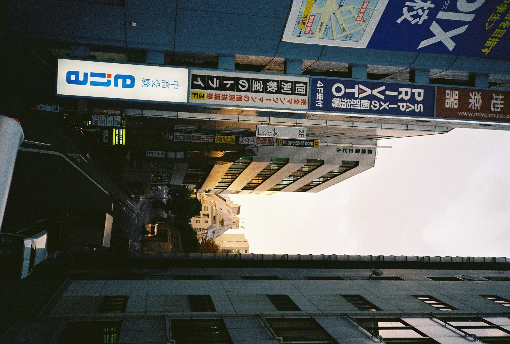
	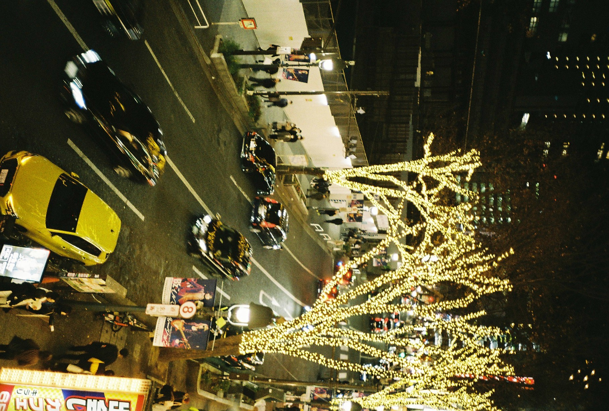

	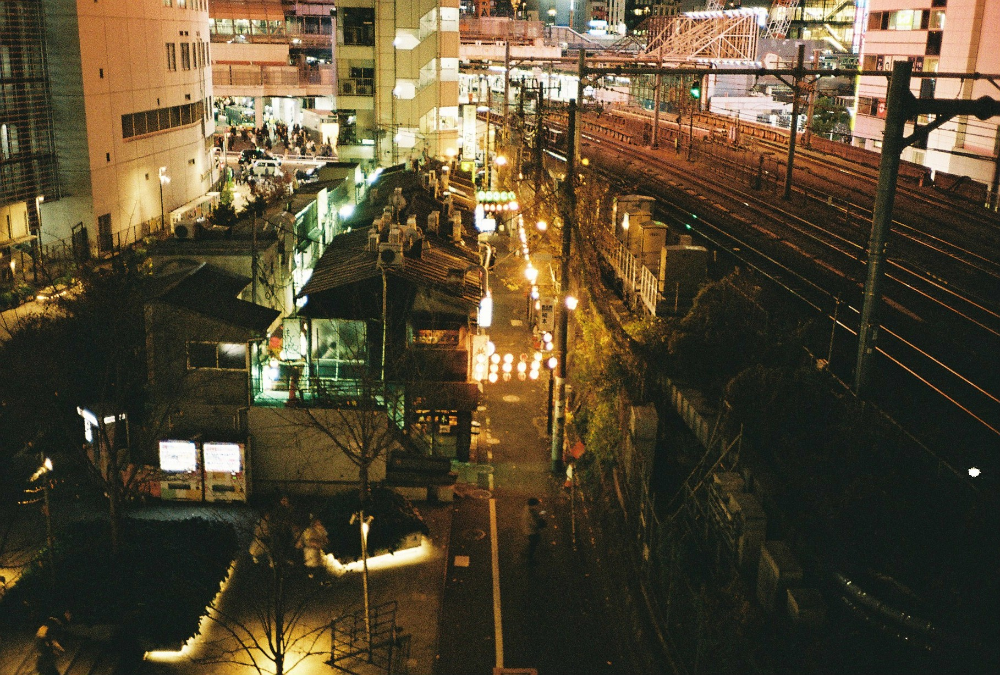
	

Film used: Kodak Gold 200

	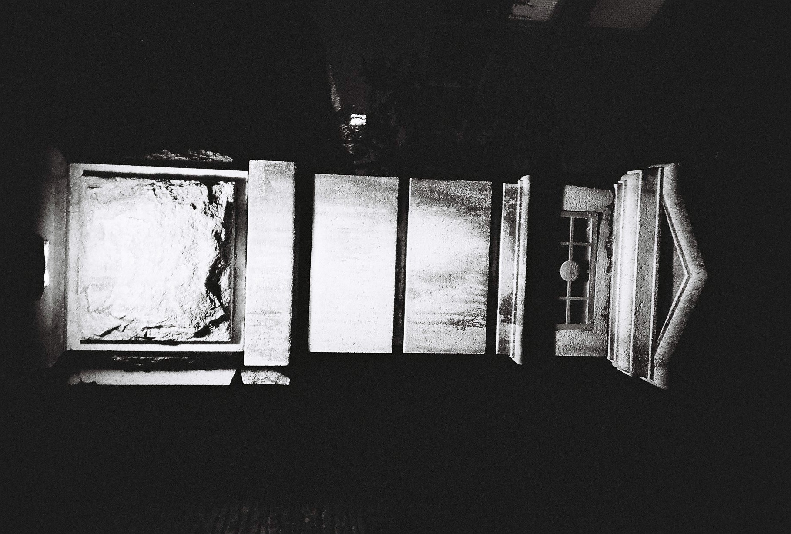
	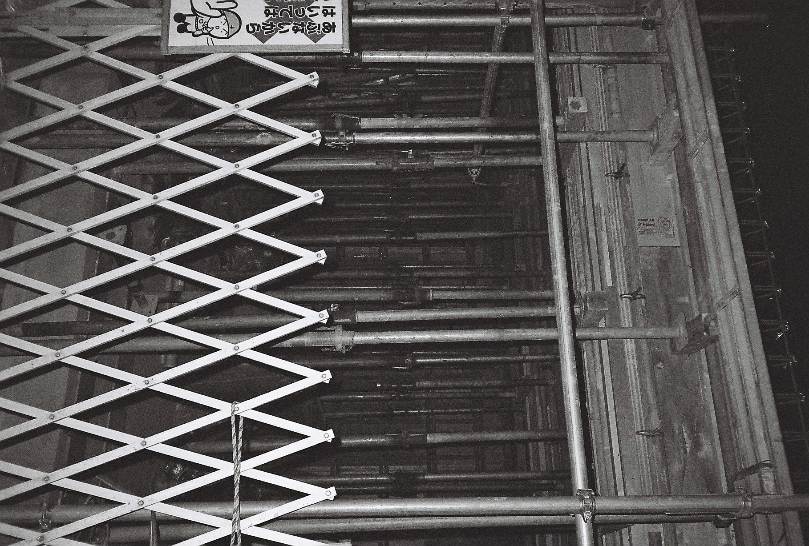
	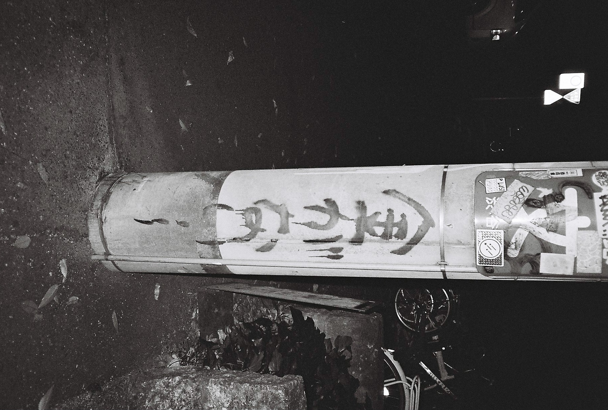

	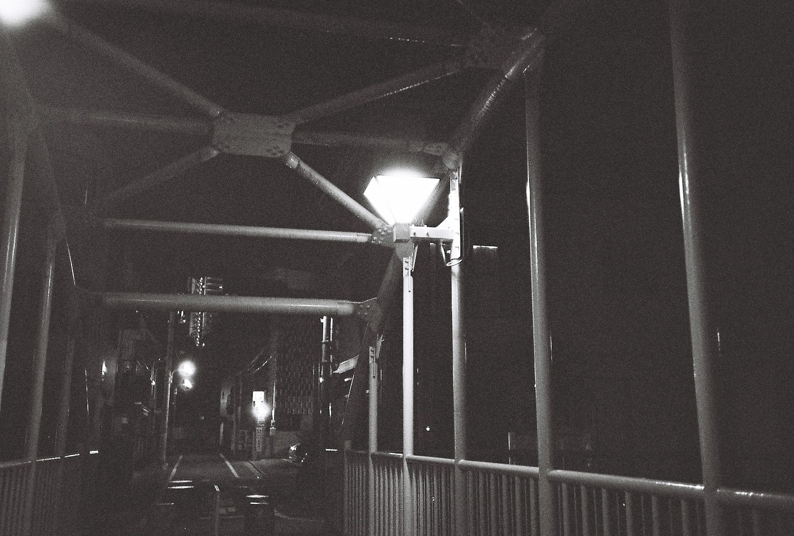
	
	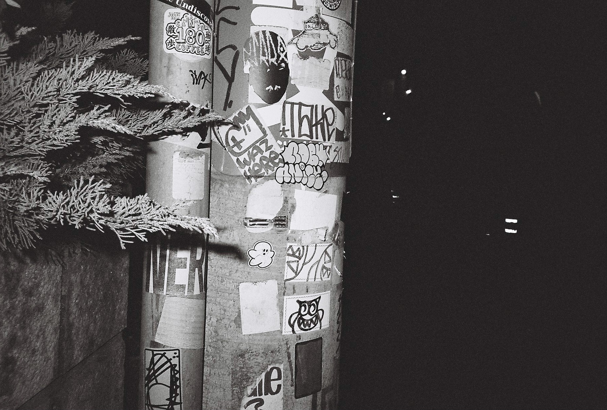

Film used: Ilford HP5 400. I discovered that night-time photography is quite difficult for my shaky hands.

I feel like I'm deprogramming myself from the instant gratification of the digital smartphone camera era. It's nice having a high-quality camera with me at all times stuck to my smartphone - but it's also really exciting having to wait for a film roll to be developed to see how my shots turned out. The anticipation is humbling.
 
Film is expensive though, so I hope I get better at photography soon so that I stop wasting half of the shots 😇...

Lots to look forward to. Happy new year!

良いお年を！来年もよろしくお願いします🎵