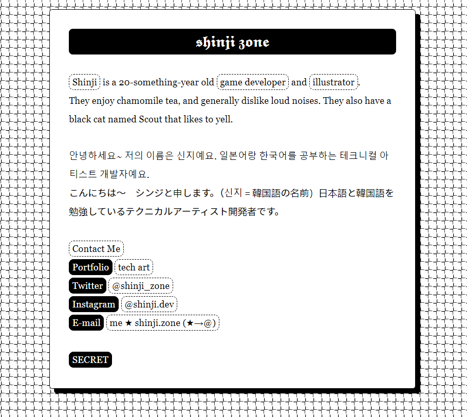
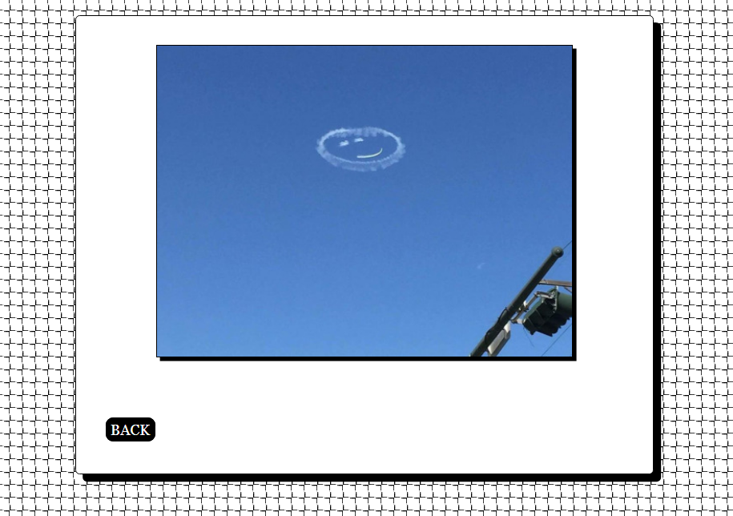

I finally added a blog to my site!!!

To go back a little further in time: in 2022, my site used to just be a simple Twine file that acted as a landing page that linked to my social media sites. 

	
	

Some screenshots of my old site. If you clicked on the "SECRET" button then it would display a random image that I liked.

It served me just fine for a handful of years, but eventually I got the brainworms to tear down my site and build it back up from the ground-up. At the start of this year I refreshed my site! Luckily it was fairly easy to do so with <a href="https://www.jekyllnow.com/">Jekyll Now</a>.

This time (9 months later), I wanted to add the framework to support blogposts. I also had to set up my PC to be able to work on my website. Even with tutorials, I spent hours trying to set up my environments and get Ruby and Jekyll and everything working... I feel like there were a million steps where I ran into errors, but now everything is working! I even set up my Sublime Text with LiveReload/Browser Sync so that I can test my changes locally simply by saving and waiting for my browser to refresh. It's certainly faster to iterate than waiting for Unity to finish compiling a whole project. I had a lot of fun casually dabbling in web dev despite all of the headaches along the way. You web developers out there are so strong...

Even after spending so much time setting up this blog, I don't think I'll write blog posts very often. I'm pretty bad at putting my thoughts into words in general. Also, I'm lazy. But it would be nice to archive some musings on my site, as few and precious as they are. I feel like if I post them on social media like X or Instagram they'll get washed away and I'll forget all of my ideas!

I still have a few things I'd like to do, but for now I'll stop tinkering and make some dinner.