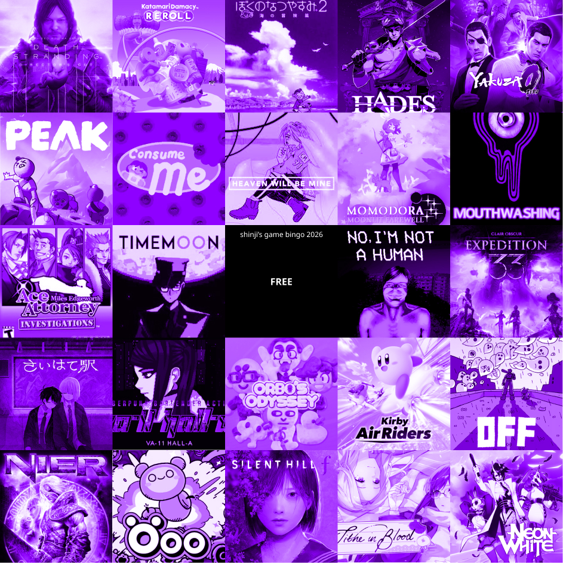

what a wild year...!

 

<falselink>Thinking back on my 2025 goals</falselink>

<b>Learning goals</b>

I sure did study Japanese a bunch! I even took the JLPT N2 earlier this month. I also learned some new software (AfterEffects, ProtoPie) and got back into learning Blender and DaVinci Resolve. Yay!

<b>Project goals</b>

Didn't finish anything worth sharing, but I made some meaningful progress on personal projects. I even did a game jam!!

<b>Posting goals</b>

I managed to post on the internet a little more often! A grand total of... two blog posts, five Instagram posts, and lots of rambling on Bluesky.

<b>Health goals</b>

My average step count increased from last year, but I want it to be higher!!

<b>Get a cat</b>

I didn't get a cat... I got a boyfriend instead, a different kind of creature. It's been great for me though!

For 2026 I'll keep my resolutions to myself, written in my notebook... but generally I'd like to be healthier, use my time more wisely, and focus on finishing and publishing my work. And I <i>will</i> get a cat!!!

 

<falselink>I made bingo cards for 2026???</falselink>

I made some bingo cards as a way to try to focus on playing more games and making more stuff... will it work? I dunno! but it might be fun to try to get some bingos. I'd be really pleased even if I just got one on each card :)

	

Game Bingo 2026

	

Creative Bingo 2026

 

<falselink>Some stuff I enjoyed in 2025!</falselink>

    
Movies I watched/rewatched (my favorites marked with 💟, rewatches with 🔁)

	<li>Nosferatu (2024)</li>
	<li>The Substance (2024)</li>
	<li>Mobile Suit Gundam GQuuuuuuX -Beginning-　/　機動戦士Gundam GQuuuuuuX (2025)</li>
	<li>💟 Skinamarink (2022)</li>
	<li>🔁 Zodiac (2007)</li>
	<li>1st Kiss /　ファーストキス (2025)</li>
	<li>Mickey 17 (2025)</li>
	<li>Mononoke the Movie: Chapter II - The Ashes of Rage　/　劇場版モノノ怪 第二章 火鼠 (2025)</li>
	<li>Lost in Translation (2003)</li>
	<li>💟 Mother　/　마더 (2009)</li>
	<li>💟 Conclave (2024)</li>
	<li>Past Lives (2023)</li>
	<li>Sinners (2025)</li>
	<li>KPop Demon Hunters (2025)</li>
	<li>💟 Kinki　/　近畿地方のある場所について (2025)</li>
	<li>Dog Day Afternoon (1975)</li>
	<li>Oppenheimer (2023)</li>
	<li>Arrival (2016)</li>
	<li>Cloud クラウド　(2024)</li>
	<li>Chainsaw Man - The Movie: Reze Arc　/　チェンソーマン レゼ篇 (2025)</li>
	<li>💟 Kokuho　/　国宝 (2025)</li>
	<li>Tatsuki Fujimoto 17-26　/　藤本タツキ 17-26(2025)</li>
	<li>💟 The Flow of a River, the Sound of a Violin　/　川の流れはバイオリンの音 (1981)</li>
	<li>The Family Man (2000)</li>
	<li>🔁 The Garden of Words　/　言の葉の庭 (2013)</li>
	<li>🔁 Battle Royale　/　バトル・ロワイアル (2000)</li>
	<li>Oi, Dazai　/　おい、太宰 (2025)</li>
	<li>Cherry Magic! THE MOVIE　/　チェリまほ THE MOVIE (2022)</li>
	<li>💟 The Fall (2006)</li>
	<li>🔁 Tokyo Godfathers　/　東京ゴッドファーザーズ (2003)</li>
	 
	I love movies!! "The Flow of a River, the Sound of a Violin" and "The Fall" are definitely top ones to watch whenever I become pessimistic about AI supposedly taking over creative fields. No way, man... Media literacy may be dying, but I believe that people will always value a story created by human effort. 
	The issue is that a lot of higher ups that actually have money and power seem to lack taste... but oh well, that's their problem and not mine. 
	 

	
Games I played/replayed, in no particular order

	<li>Final Fantasy XIV (MMORPG)</li>
	<li>VRChat</li>
	<li>Apex Legends</li>
	<li>The Binding of Isaac: Rebirth</li>
	<li>Monster Hunter Wilds</li>
	<li>gogh: Focus with Your Avatar</li>
	<li>Balatro</li>
	<li>SAEKO: Giantess Dating Sim</li>
	<li>UFO 50</li>
	<li>Japan Stigmatized Property</li>
	<li>Diablo 4</li>
	<li>Mother 2</li>
	<li>Boku no Natsuyasumi 2</li>
	<li>Miffy's World!</li>
	<li>Hatsune Miku: Colorful Stage!</li>
	<li>A HERO AND A GARDEN</li>
	<li>Sephonie</li>
	 
	I actually didn't play a lot of games this year, which I feel embarrassed about...
	 

	
Online content creators I watched this year

	<li>敷嶋てとらch.　Shikishima Tetra</li>
	<li>ぽんぽこちゃんねる　Ponpoko Channel (Ponpoko and Peanuts-kun)</li>
	<li>月ノ美兎　にじさんじ所属ライバーさんのコンテンツ（ろふまおとか）　Tsukino Mito, and other Nijisanji-affiliated liver content (ROF-MAO and whatnot)</li>
	<li>ヘアピンまみれ　Hairpin Mamire</li>
	<li>NorthernLion (funny bald man)</li>
	<li>よしみ子のおひとり様ライフ　Yoshimiko's solo life (solo travel/minimalist lifestyle)</li>
	 
	In the start of 2025 I thought I had basically graduated from my deepest Vtuber otaku phase, but somehow Vtubers remain my most-watched content... I might be falling into the rabbithole again, but it's okay. I'm watching a lot less gameplay streams, and more videos that are more like vlog-style content. I find the stuff that blends virtual with real life, or shares knowledge about new skills to be the most interesting and exciting. In particular, 自作 (self-made) indie creators are the ultimate inspiration to me, and it's been giving me a lot of stuff to think about for what I'd like to do in the future..
	 

Every year I end up listening to the same mix of music... Lots of house music, drum and bass, indie folk, Vocaloid, Yaeji, and Utada Hikaru obviously. 
I was able to go to an Ichiko Aoba concert in Yokohama and Sean Oshima live in Shimokitazawa!
And I even did a performance myself, as my violist debut...!! I rented a viola for a short period, and basically only had a week to transcribe my music and get a feel for the instrument. It was a whirlwind... but surprisingly not that hard to go from transitioning from violin to viola. Personally, I enjoy the viola more than the violin, both tonally and personality-wise.

I'm still super into cameras and I even got my first digital camera (a Pentax K-70 DSLR)! I'm very slow at editing photos but I'll keep posting them on my Instagram.

When I think about how this year went... My work and personal life experienced some huge transitions. As always, with change comes uncertainty. There were many times where I was way too worried about things out of my control. What matters is that I made it through the year. At the end of the day I think I challenged myself in some meaningful ways that allowed me to grow.

I've been working in Japan for about 2.5 years by now, and the longer I live here the more I enjoy it. This year I realized that I could actually see myself staying here longterm instead of going back to the states, and that revelation has helped me adjust my focus.
I hope that next year, I can have a little bit more chill, but keep working on the stuff that I care about. 

Anyway, goodbye to 2025, and see you next year! 2026年もよろしくお願いします🎵