thinking about how important breakfast is 

	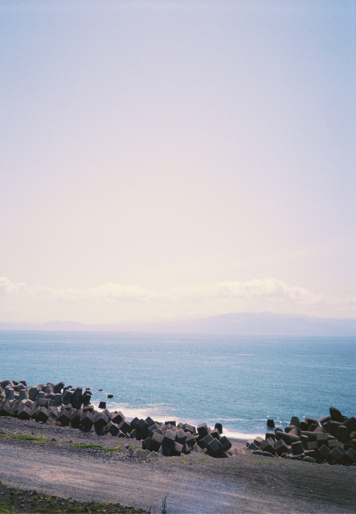

Oceanside in Shizuoka

Oops, the year is passing by so quickly. My birthday was a couple months ago in June! Now it's August, and the summer heat here in Tokyo is still miserable.

	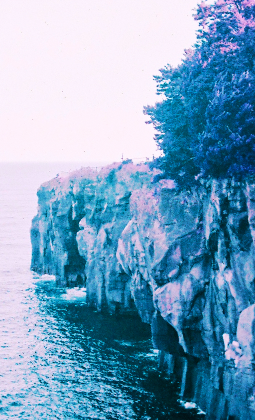
	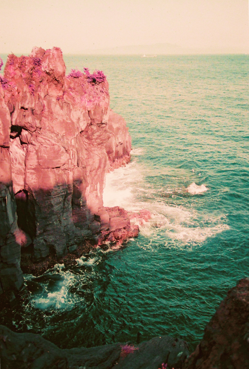

Jogasaki Coast

Lately I've been thinking about something very simple: the importance of breakfast.

<falselink>Why Breakfast is Good, Actually</falselink>

- I'm motivated to wake up earlier, and I feel less time pressure to get ready in the mornings.
- Normal breakfast ingredients like bread, eggs, milk etc. have a shorter shelf life than stuff like... instant noodles or whatever? so I routinely go grocery shopping. I'm cooking a lot more these days.
- The days I eat breakfast, it means my brain has been awake and my body has been moving long before I go to work. I have more brain juice to calmly deal with whatever comes up.
- I can't start my day without coffee, and with breakfast, I avoid getting caffeine shakes.
- By the time lunchtime rolls around, I still get moderately hungry, but I get less of that carnal urge to inhale a plate of tonkatsu. My stress tends to peak in the AM/early PM hours so I want to avoid the stress eating when I can.
- Starting the day by eating something yummy... I feel like a human being
- By nighttime, I try to eat early-ish so that I don't sleep with food in my system, which means less weird dreams that mess with my sleep health.

Of course, everyone's bodies and needs are different. But as someone who used to swear by only 1-2 meals a day it's nice to see positive results from this change in my daily routine.

I've learned that I need to feed my brain calories regularly throughout the day. Not only just to get through the slog of work and life, but also in order to handle the heavy lifting of working in a foreign language and living in a foreign country. That's an additional mental tax that I discovered that I really need to account for! My brain is working hard so I gotta eat to replenish my brain juice...

Anyway, I'll try to write about something more interesting next time. I hope everyone stays healthy! Here are some more photos I've taken this year. (slowly working through my photo backlog but I'm slow at editing...)

	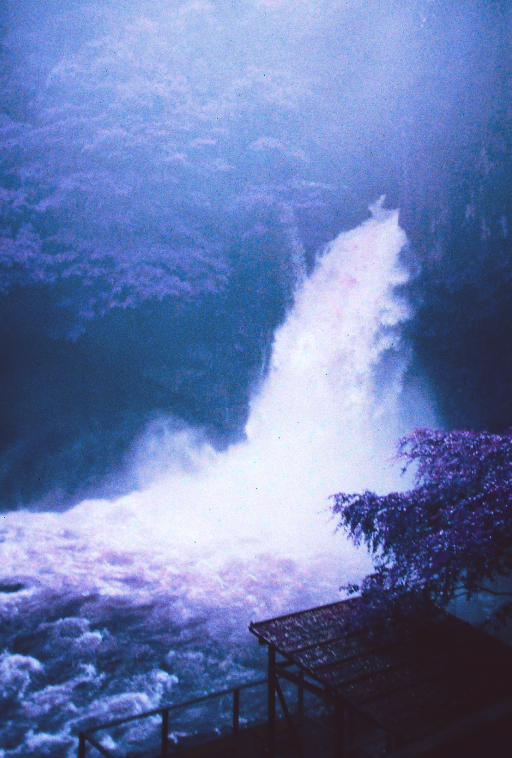
	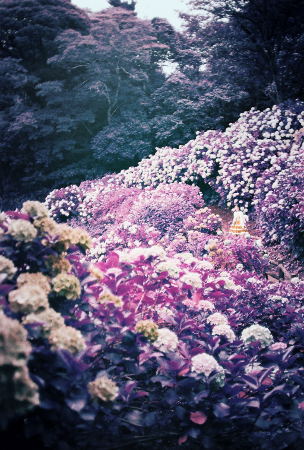

Kawazu Seven Waterfalls, Shimoda Park

	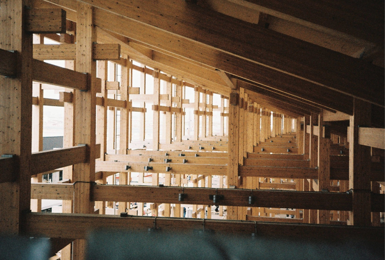

Osaka World Expo's Grand Ring. I ate Romanian food for the first time.

	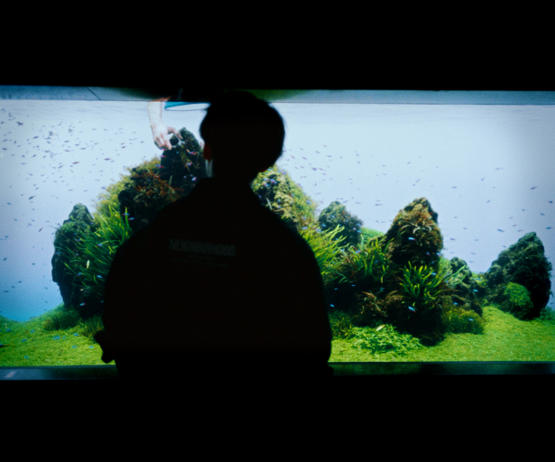

	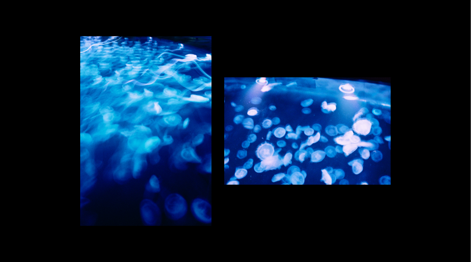

Sumida Aquarium

	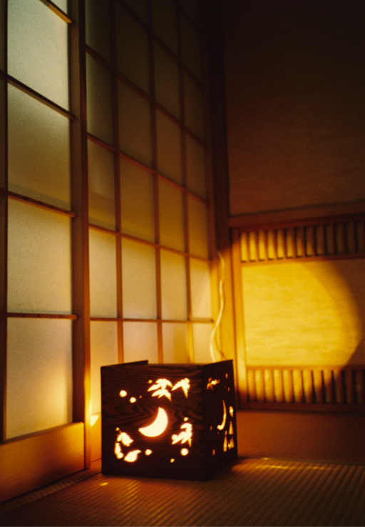

	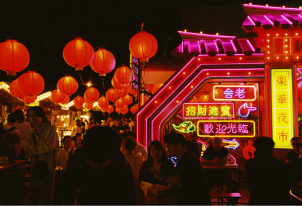
	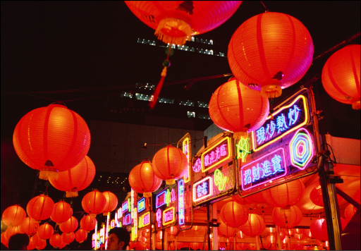

Nikon L35AD  with probably Kodak Ultramax 400? I'm too lazy to look up what I used
