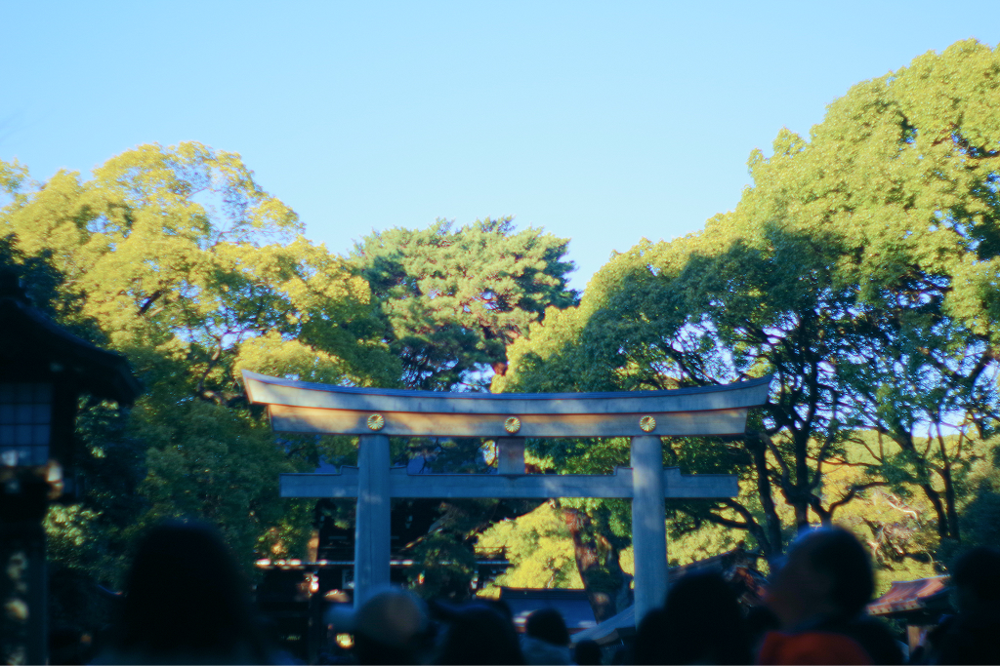
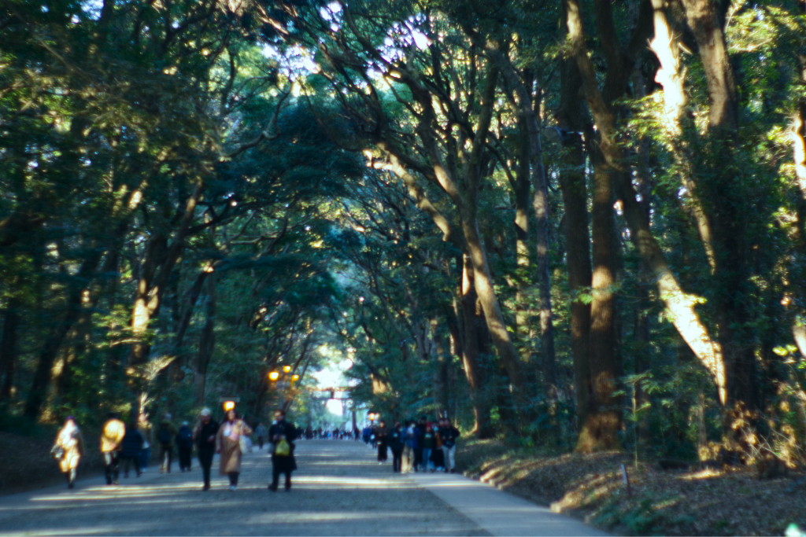
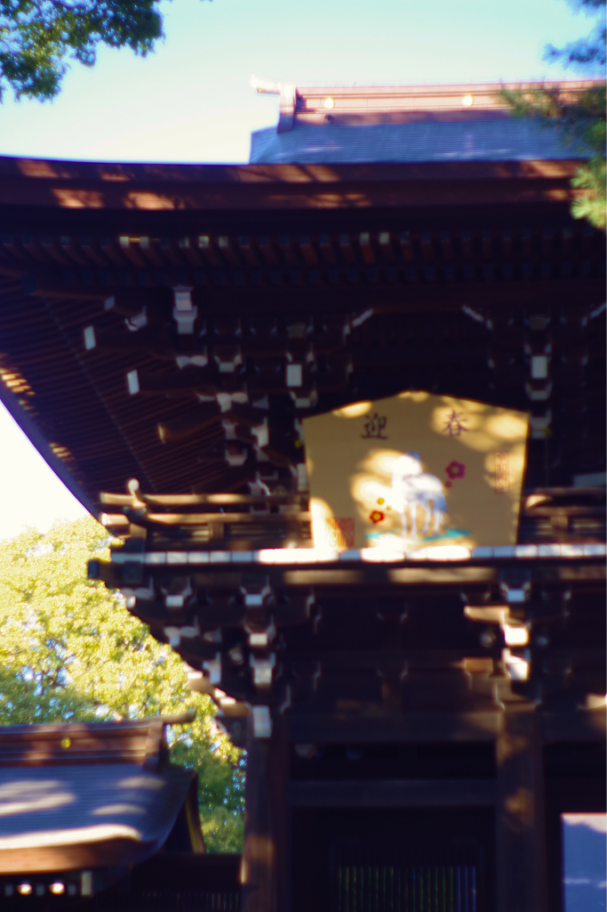
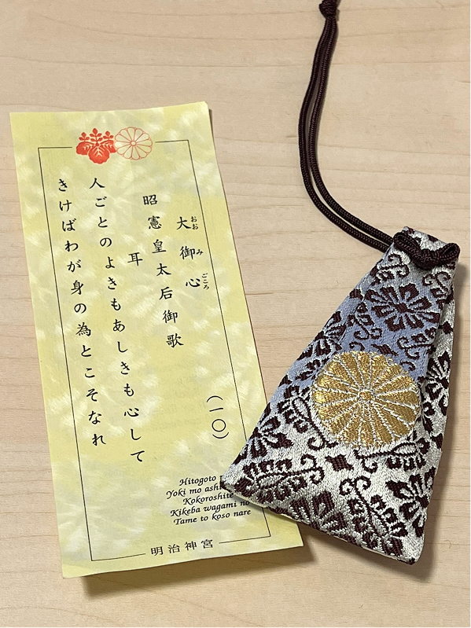

first post of 2026

 

<falselink>Hatsumode</falselink>

It's my third time going to Meiji Jingu for my first shrine visit of the year! I brought my Pentax K-70 with A-prime 50mm F2 film era lens to take a few photos. I edited them a bit to adjust colors.

I still need to get used to the actual camera's functionalities. Sometimes my photos are out-of-focus or over-exposed - but I'm really entranced by how soft the lights come out. I think using a digital camera body with film-era lenses and controlling the focus in a super manual way is a really fun way to do photography.

	
	

Meiji Jingu

	
	

Meiji Jingu

Whenever I visit, it always surprises me how wide the space is! We basically started from Harajuku station, walked through the shrine path, went all the way up to Yoyogi station, and then back to Harajuku station. It feels like you're walking through a forest, which is amazing because you're basically a stone's throw away from Harajuku's busiest streets.

	

omikuji (randomly-drawn fortune) + omamori (amulet for my health)

Other people's words, 
Sometimes good and sometimes bad, 
Need to be heeded; 
If we listen carefully 
We can benefit ourselves.

Meiji Jingu's omikuji are unique in that, instead of writing down different levels of luck (big luck, small luck, etc.), they write down a little poem. The poems offer words of advice. My omikuji is telling me to shut up and sit down and listen!!! ok I will.

 

<falselink>3-day weekends are awesome</falselink>

they should invent a society where every weekend is a 3-day weekend 

- walked 30,000 steps
- watched 2 movies
- made good progress on a game jam game
- ate delicious food (tacos...)
- cooked a lot
- got my first Japanese credit card

... and I got a massage which was also really awesome! but the nice lady told me that my shoulders needed more work... well, it's my fault for having terrible posture while I work. and I'm getting old. I think a lot of my nervous energy is stored in my neck/shoulders so I'm going to focus on improving that this year. 

There will always be a multitude of reasons to feel nervous and stressed and embarrassed and just... awful. But my time is better spent on something else other than feeling awful, because there's enough of that energy out there.

So with that let's re-enter society... and wait for the next 3-day weekend... which looks like the last week of February!!