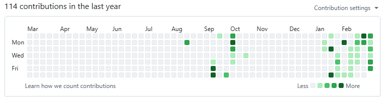
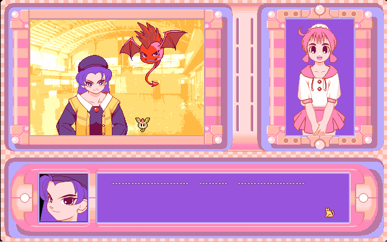
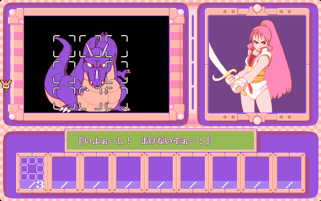

queer vampire game jam 2026 devlog

 

<falselink>I finally made a freaking game</falselink>

I made a visual novel about a terrible vampire lady and her many, many batgirl lovers over thousands of years! I think this is my first finished game project that I released publicly in like seven years... what the heck. I should probably do this more often, huh.

<iframe frameborder="0" src="https://itch.io/embed/4292505?linkback=true" width="552" height="167"><a href="https://jocelyn.itch.io/metamorphosis">Metamorphosis by shinji</a></iframe>

Originally I was planning on making something that I could submit to the <a href="https://itch.io/jam/swakjam-2026">Sealed With A Kiss Jam</a> and the <a href="https://itch.io/jam/queer-vampire-game-jam-2026">Queer Vampire Game Jam</a>, but I realized that I had too much stuff I wanted to add to make the first deadline. So I ended up only submitting to the Queer Vampire Game Jam, which was more fitting thematically in the end. 🧛🩸🦇

(Thanks to my friend <a href="https://npckc.net/">kc</a> for sharing the game jams with me, answering my Ren'Py questions, and for pointing out a pretty critical issue with my builds!)

I started off with some vague ideas:
- the natural affinity between vampires (immortal) and bats (mortal)
- being immortal is lonely and it probably distorts your psyche quite a bit
- what if a vampire falls in love with a bat???
- cycles of toxicity repeating, even when you love someone

For a while I was like "haha. how interesting :)" and I drafted out the character ideas/designs pretty quickly, and set up the Ren'Py project... And then for a couple weeks I didn't really do much besides rotate the characters and scenarios in my brain... 

I think it was a good time to let the ideas ferment. Game jams that are like a month-ish long are perfect for me, because I like to be able to slow down and take time to think. If I try to push through on ideas too quickly I feel like I end up getting lost, and I end up scrapping the idea before doing anything interesting with it. (also, I don't feel super pressured, so I can still go out and do fun things with my friends without feeling guilty about not constantly working on my game. it's important to go outside and cherish the precious time with your friends!)

For some reason I spent a full night painstakingly translating a song's lyrics from Japanese into English, and timing the lyric display for my game's ending... which is hilarious to me in hindsight that I made this game end with a pop song. But it's a really cute song so please listen to it <a href="https://dova-s.jp/EN/bgm/play22424.html">here!</a> (or play my game to see real-time lyrics/visuals)

<iframe width="560" height="315" src="https://www.youtube.com/embed/px7rADu6T3c?si=bCeT43nYiV9AlmTd" title="YouTube video player" frameborder="0" allow="accelerometer; autoplay; clipboard-write; encrypted-media; gyroscope; picture-in-picture; web-share" referrerpolicy="strict-origin-when-cross-origin" allowfullscreen></iframe>

ヴァンパイアガール - ゆうり　歌詞（日本語・英語） Vampire Girl - Yuli Audio Craft (Japanese + English lyrics)

    確かに愛した　何千年も前の事だっけ　思い出す 
    I remember that I loved you, once upon a time 
    So many thousands of centuries back in history 
     
    月夜がキラキラ幾千年もぐるぐる世界は回ってる 
    Starry skies were sparkling for millions of years 
    While Planet Earth was pirouetting, round and round 
     
    重い瞼をこじ開けて　朝日を睨みつけ 
    As I open up my heavy eyelids, I squint at the rising morning sun 
     
    今日も独りきりで　小さく歌を歌う 
    I'm still all alone, by myself, but I'll sing my little song 
     
    あなたの血が吸いたいの　今でも愛しているの 
    I want to suck all your blood for myself 
    Even to this day I still love you 
     
    気づくのが遅すぎたの　呪われて生きているの 
    It took me until now to realize that 
    I'm doomed to keep living with this curse now 
     
    あなたの手に触れたいの　またあたためて欲しいの 
    I just want to hold your hand one more time 
    I want you to warm me up one last time 
     
    毎日泣いているの　さよなら今もできないの 
    Every day I cry my heart out for you 
    I still can't bring myself to say goodbye to you 
     
    悪魔の口づけペペロンチーノ　もう一度ちょうだい　ウィジャボード 
    A Kiss from the Devil, was like peperoncino 
    Give it to me one more time, Ouija board 
     
    コインの裏とか表とか　そういう問題ではないの 
    Flip a coin to see if it goes heads or maybe tails 
    either way I think it would be missing the point 
     
    痛いくらいの十字架が　胸に刺さって抜けなくて 
    The pain of a cross stabbed into my chest 
    as hard as I tried I couldn't pull it out 
     
    いつも独りきりで　苦しみもがいてる 
    Suffering with agony alone 
    forever I will be on my own 
     
    あなたの血が吸いたいの　今でも愛しているの 
    I want to suck all your blood for myself 
    Even to this day I still love you 
     
    気づくのが遅すぎたの　呪われて生きているの 
    It took me until now to realize that 
    I'm doomed to keep living with this curse now 
     
    あなたの手に触れたいの　またあたためて欲しいの 
    I just want to hold your hand one more time 
    I want you to warm me up one last time 
     
    毎日泣いているの　さよなら今もできないの 
    Every day I cry my heart out for you 
    I still can't bring myself to say goodbye to you 

 

<falselink>Process and tools</falselink>

My overarching goal was to re-learn <a href="https://www.renpy.org/">Ren'Py</a> and get a feel for how to structure a project and pace things through art/transitions. I hadn't touched it since I was in college, but it was surprisingly easy to jump into! Ren'Py feels like a breath of fresh air after primarily using Unity for the past 10 years. It's so nice to use an engine and have competent documentation and vibrant community resources that don't feel so grifty. And it's so nice when basic functions to just.... work, out-of-the-box, exactly how I expect them to. Amazing!!!

Process-wise, I used Procreate on my iPad to draw everything, and <a href="https://www.figma.com/">Figma</a> to make the GUI and composite everything together. I'm happy with how quickly I was able to create a pretty large volume of assets (90 character sprites, 10 CG art). I pulled all of the backgrounds from <a href="https://unsplash.com/">Unsplash</a> which was convenient... but I feel ambivalent about it since it seems like photographers basically upload free content to be paid in ~exposure~. I have no idea what stock photo sites are like these days but if I do another project where I need to source a lot of photos, maybe I'll pay for a month of Unsplash+ or try to find a site that pays royalty fees per-image or something...

I think it was a little crazy of me to write over 18,000 words for this game jam so I'm looking forward to doing something less text-heavy for my next project. Maybe in the next game I make everyone will communicate in caveman grunts. 

	

look at all the green at the end!!! can I keep my 2026 looking healthy and green??

 I'd love to make another visual novel-style game in Ren'Py in the future, but for my next project I'll probably try out a different game genre and engine. Maybe Godot? It seems like the community resources have really stepped up recently.

 Game jams are a great excuse to kick my ass into gear and finish stuff! Everyone should do game jams and make weird small games!!!
 Especially with the state of the games industry now, where all of these huge companies are terrified of losing profits, and can only commit to pumping out extremely polished-but-boring remakes and sequels to established franchises... I would love for people to create fresh stuff that cost less to make...

 Making games that are smaller, cheaper, rougher around the edges, and more freaky and niche is really good, actually.

 

<falselink>Unused ideas graveyard</falselink>

So one of my starting ideas in this game jam was the desire to use GUI/character art to visually enforce the passage of time. Originally I wanted to have three distinct settings - ancient Eastern Europe, medieval Korea (Chengok), medieval Japan (Hokkaido), and finally modern America (Chicago). Each setting would have a unique GUI and the Vampire characters' attire would change accordingly. In the end, that got pared down to two settings and basically two GUI styles.

Maybe I'll try to revisit that idea again. It might be fun to make a PC-98-esque game that has over-the-top GUI elements... like this game I randomly came across - <a href="https://www.pc98.org/bgsaori.html">「究極変幻バトルギャルさおり」 Ultimate Transformation Battle Girl Saori (1995)</a>. 

	
	

There are loads of awesome PC-98 games with super intricate and beautiful interfaces out there, but this one's bright simplicity made me think of Tamagotchi's egg designs. Cute!

Another idea I had was incorporating found-footage aspects, which is one of my favorite genres as of late. I wanted to set up a very specific kind of spooky vibe, but eventually I realized that I didn't actually want to go through with it because:
- I had to spend a considerable amount of time creating assets with the right amount of "realness". Social media with a bunch of unique users posting messages... A news report clip... A pile of cheesy occult magazines with articles... 
- In found-footage horror, everyone loves to see a spooky video from a haunted tape or whatever... but I didn't have the video-editing dog in me this month
- When I started gathering photos of various types of content, it made me think about how the fun of found-footage is the differences in each medium. I felt like I couldn't execute on the idea too well by simply slapping some images and text into a visual novel
- I love found-footage/mockumentary too much, so if I wanted to make something in a similar vein for my first time, I wanted to do it properly!
- I had started the project with a far darker premise overall, planning to go much deeper into the dark/adult themes in the game. But as I kept writing, I was also writing a lot of stupid jokes and softer moments to show character appeal... it ended up being a lot lighter than I had anticipated. So the found-footage stuff felt like it clashed with what I was writing, and I decided to shelve those portions completely.

Anyway, I couldn't make it work for this project, but I'd love to give it a shot someday!

 

<falselink>Found-footage/mockumentary media yapping corner</falselink>

Speaking of which, there are some total bangers in the genre that have been coming out recently!

 
<a href="https://www.youtube.com/watch?v=AGvx3tN2xnE"> 放送局に届いたある映像 (Footage Received by a Broadcasting Station) by エンタメ～テレ</a> 

There are currently 5 episodes out in this collection of totally different stories that are all somehow connected by a single thread... I'm obsessed. This feels more like a typical scary found-footage horror. The next episode「Tape.6 AIの心霊動画は呪いを生むのか？」(Tape #6 Can AI-generated paranormal videos be cursed?) sounds like an interesting exploration of the idea of hauntings occuring in digital spaces... (if you fuck with me even the littlest bit please watch <a href="https://en.wikipedia.org/wiki/Pulse_(2001_film)">回路/Pulse</a> directed by Kiyoshi Kurosawa)

 
<a href="https://www.youtube.com/watch?v=OEuhvu-Yi5E">「UFO山」(UFO Mountain) by TXQ Fiction</a>

TXQ Fiction's second-newest series. It's maybe not outwardly "scary" (which I was a little disappointed by because I grew up being terrified of the cheesy late-night TV shows on aliens) but it's definitely unsettling. There were a ton of disparate plot points and possibly intentional red herrings, so watching it felt like I was being dragged all over the place and being shown a bunch of closed doors, never being given the key to unlock them... but in that confusion, it made me think pretty deeply on "why humans seek patterns" and "why humans need to create narratives". One man's conspiracy theory is another man's cope.
I still haven't checked out the newest series that they're releasing (神木隆之介 Ryunosuke Kamiki) but oh man I hope it's about parasociality, or like how insane cults of personality are around celebrities... Excited!

 

Okay! That wraps up my deranged ramblings for the month!!!